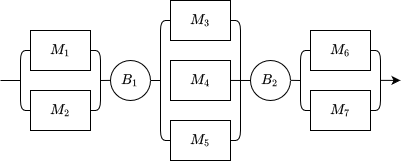

Examples
========

Additional examples can be found in the Github repository under ``simantha/examples``.

Single Machine Degradation
--------------------------

The following example implements a single machine that is subject to Markovian degradation. 

.. image:: images/one_machine.png
   :align: center

.. code-block:: python

    import random

    from simantha import Source, Machine, Sink, System, utils

    degradation_matrix = [
        [0.9, 0.1, 0.,  0.,  0. ],
        [0.,  0.9, 0.1, 0.,  0. ],
        [0.,  0.,  0.9, 0.1, 0. ],
        [0.,  0.,  0.,  0.9, 0.1],
        [0.,  0.,  0.,  0.,  1. ]
    ]

    source = Source()
    M1 = Machine(
        name='M1',
        cycle_time=1,
        degradation_matrix=degradation_matrix,
        cm_distribution={'geometric': 0.1}
    )
    sink = Sink()

    source.define_routing(downstream=[M1])
    M1.define_routing(upstream=[source], downstream=[sink])
    sink.define_routing(upstream=[M1])

    system = System([source, M1, sink])

    random.seed(1)
    system.simulate(simulation_time=utils.WEEK)

    # Output:
    # Simulation finished in 0.34s
    # Parts produced: 7963

Parallel Stations
-----------------

In this example several machines are arranged in parallel to form stations. This arrangement is sometimes referred to as a series-parallel configuration. 

.. code-block:: python

    from simantha import Source, Machine, Buffer, Sink, System, utils

    source = Source()

    M1 = Machine('M1', cycle_time=2)
    M2 = Machine('M2', cycle_time=2)
    station1 = [M1, M2]

    B1 = Buffer(capacity=5)

    M3 = Machine('M3', cycle_time=3)
    M4 = Machine('M4', cycle_time=3)
    M5 = Machine('M5', cycle_time=3)
    station2 = [M3, M4, M5]

    B2 = Buffer(capacity=5)

    M6 = Machine('M6', cycle_time=2)
    M7 = Machine('M7', cycle_time=2)
    station3 = [M6, M7]

    sink = Sink()

    source.define_routing(downstream=station1)
    for machine in station1:
        machine.define_routing(upstream=[source], downstream=[B1])
    B1.define_routing(upstream=station1, downstream=station2)
    for machine in station2:
        machine.define_routing(upstream=[B1], downstream=[B2])
    B2.define_routing(upstream=station2, downstream=station3)
    for machine in station3:
        machine.define_routing(upstream=[B2], downstream=[sink])
    sink.define_routing(upstream=station3)

    objects = [source] + station1 + [B1] + station2 + [B2] + station3 + [sink]
    system = System(objects)

    system.simulate(simulation_time=utils.WEEK)

    # Output:
    # Simulation finished in 1.54s
    # Parts produced: 10074
