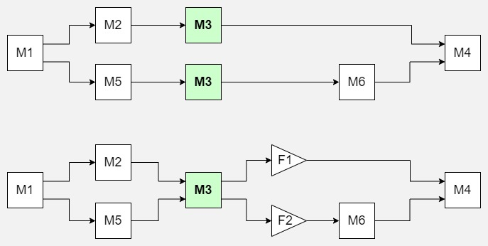

# Examples

All of the examples are part of the open source repository on GitHub: [examples/](https://github.com/usnistgov/simprocesd/tree/master/examples)  

Once you have the SimPROCESD package installed and the source code downloaded you can run examples like so:
```
# To run SingleMachine.py example navigate to the root folder of SimPROCESD
# and run the following command:
python -m examples.SingleMachine
```

**[SingleMachine.py](https://github.com/usnistgov/simprocesd/blob/master/examples/SingleMachine.py)**  
- Basic setup: Source -> Machine -> Sink
 
**[BufferExample.py](https://github.com/usnistgov/simprocesd/blob/master/examples/BufferExample.py)**  
- Using a `Buffer`.

**[ParallelStations.py](https://github.com/usnistgov/simprocesd/blob/master/examples/ParallelStations.py)**  
- Multi-stage production line with multiple machines in each stage running in parallel.

**[VariousFlows.py](https://github.com/usnistgov/simprocesd/blob/master/examples/VariousFlows.py)**  
- Model with 2 parallel production paths that both share one of the machines.
- Visual representation of the setup (see below):
	- Top diagram: the design being modeled with M3 machine as part of 2 production paths.
	- Bottom diagram: the actual model layout with a single M3 machine followed by 2 filters (`DecisionGate`) that control part flow.  
	

 
**[PartQuality.py](https://github.com/usnistgov/simprocesd/blob/master/examples/PartQuality.py)**  
- Changing/updating part quality when parts are processed by machines.

**[ExtendingPartObject.py](https://github.com/usnistgov/simprocesd/blob/master/examples/ExtendingPartObject.py)**  
- New class that extends Part in order to add a new property.
- Example model using the new class.

**[FilterParts.py](https://github.com/usnistgov/simprocesd/blob/master/examples/FilterParts.py)**  
- Setup `DecisionGate` devices to manage where parts go based on part quality.

**[OperatingSchedule.py](https://github.com/usnistgov/simprocesd/blob/master/examples/OperatingSchedule.py)**  
- Using `ActionScheduler` to control when a machine can produce parts.

**[BatchProcessing.py](https://github.com/usnistgov/simprocesd/blob/master/examples/BatchProcessing.py)**  
- Using `Batch` part type vs using individual parts.
- Using `PartBatcher` to batch and unbatch parts.

**[SingleMachineWithFaults.py](https://github.com/usnistgov/simprocesd/blob/master/examples/SingleMachineWithFaults.py)**  
- Using an extended machine class to model periodic faults.
- Configuring maintenance times determined by a geometric distribution.
- Request maintenance when machine has a fault.

**[SharedResources.py](https://github.com/usnistgov/simprocesd/blob/master/examples/SharedResources.py)**  
- Setting up machines that have to reserve limited resources in order to process parts.

**[ConditionBasedMaintenance.py](https://github.com/usnistgov/simprocesd/blob/master/examples/ConditionBasedMaintenance.py)**  
- Using an extended machine class to model accumulating damage on the machine.
- Use sensors to periodically measure machine damage and request maintenance if damage is over threshold.
 
**[MaintenanceOptimization.py](https://github.com/usnistgov/simprocesd/blob/master/examples/MaintenanceOptimization.py)**  
- Setup 5 parallel machines that accrue damage which negatively impacts part quality.
- Run a series of simulations where a different damage threshold is used to trigger machine maintenance.
- Show final results in graphs to assist with deciding the best maintenance policy.

**[DataExploration.py](https://github.com/usnistgov/simprocesd/blob/master/examples/DataExploration.py)**  
- Setup a Buffer with a sensor measuring buffer level (how many parts it is holding).
- Setup parallel machines that accumulate damage over time at different rates.
- Quality of parts is reduced based on machine's accrued damage since last maintenance.
- Machines are maintained only when they experience a hard failure.
- Demonstrate using built-in graph functions and plotting data.
 - Cumulative average throughput over time.
 - Machine damage over time.
 - Cumulative costs/values associated with sourcing parts and final part products.
 - Buffer level over time.

**[SaveSimulationToFile.py](https://github.com/usnistgov/simprocesd/blob/master/examples/SaveSimulationToFile.py)**  
- Example of saving the `System` object to a file and loading it back from the file.

**[PaperMillCmsEvaluation.py](https://github.com/usnistgov/simprocesd/blob/master/examples/PaperMillCmsEvaluation.py)[Experiemental]**  
- Simulate a manufacturing system with and without Condition Monitoring System (CMS) to get expected benefit 
of using a CMS.
- Setup a simulated CMS that tracks machine status through a sensor of part quality and has configurable 
false alert and missed alert rates.
- Setup machines with periodic soft faults, cost of maintenance, and cost of false alerts.